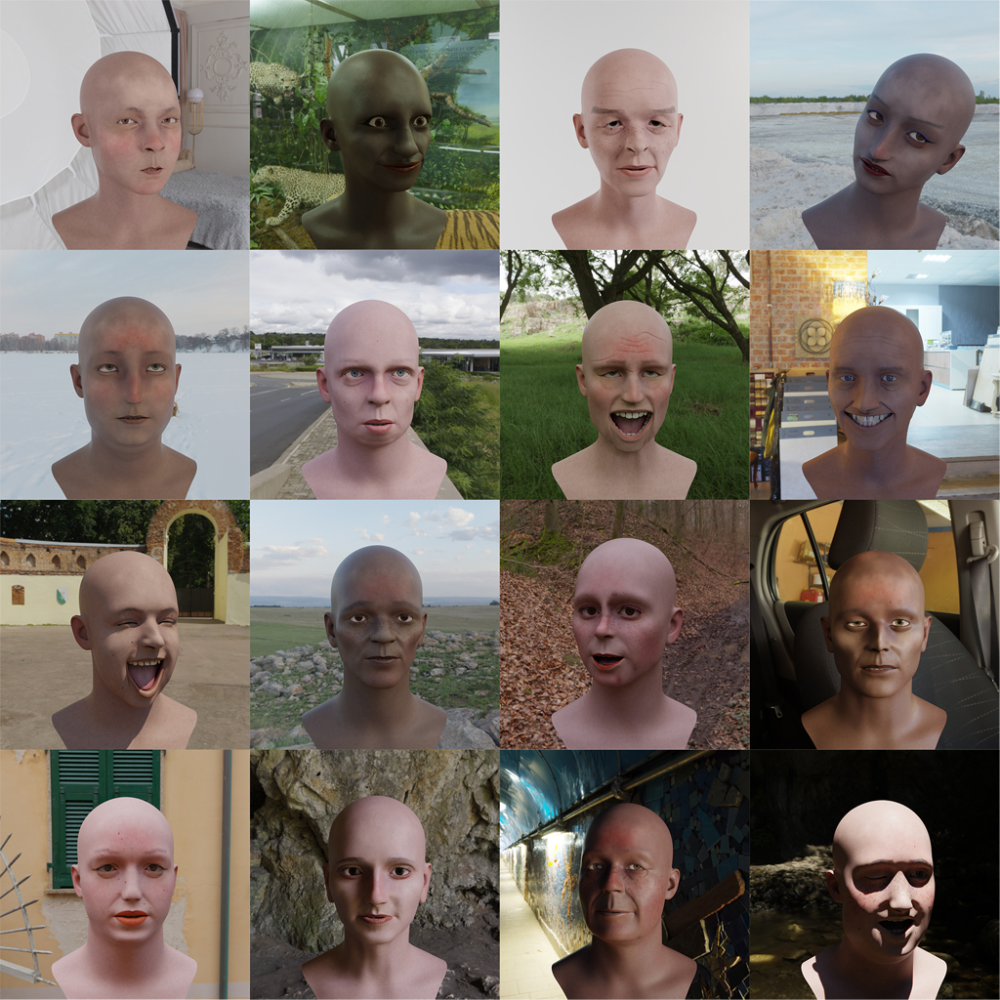
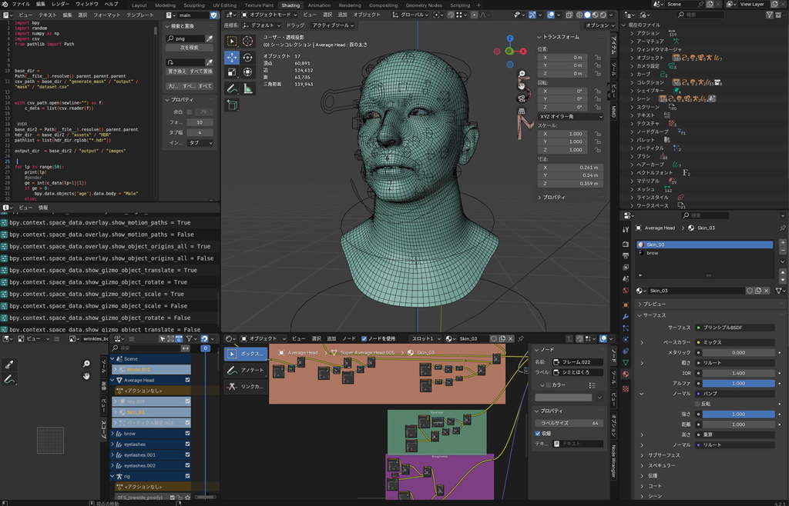

## blender-face-dataset-generator

3D フェイスモデルを使い、肌の色、しわ、メイク、髪色など多様なバリエーションを自動生成し、レンダリング画像と属性メタデータ（CSV/XLSX）を出力する Python–Blender パイプラインです。

<p align="center">
  
</p>

## 📁 フォルダ構造

```
.
├── generate_mask
│   ├── assets/      # 元となる3D顔モデルやテクスチャ
│   ├── output/      # 生成されたマスク画像＆メタデータ出力先
│   └── src/
│       ├── main.py  # エントリーポイント：マスク生成＆属性CSV/XLSX出力
│       └── modules/ # ヘルパーモジュール（ランダマイザ、エクスポータ等）
│
└── generate_face_image
    ├── assets/                   # Blender互換アセット
    ├── output/images/           # レンダリング済み顔画像
    ├── src/
    │   └── main.py               # エントリーポイント：Blenderレンダリング実行
    └── generate_face_image.blend # カメラ、ライティング、シェーダ設定入りBlendファイル
```

## 🚀 はじめに

### 前提条件

- **Blender**（4.2 以上推奨）
- **Python 3.8 以上**
- 必要な Python パッケージ（`pip install -r requirements.txt`）

  ```bash
  pip install -r requirements.txt
  ```

### インストール

1. リポジトリをクローン：

   ```bash
   git clone https://github.com/your-username/blender-face-dataset-generator.git
   cd blender-face-dataset-generator
   ```

2. 依存関係をインストール：

   ```bash
   pip install -r requirements.txt
   ```

3. **Blender シーンファイルをダウンロード**

   `generate_face_image.blend` が必要です。以下 URL から取得し、`generate_face_image/` フォルダに配置してください。

   [Blender ファイルをダウンロード](https://github.com/NakazawaTakuma/3d-face-dataset-generator/releases/download/v1.0.0/generate_face_image.blend)

<p align="center">
  
</p>

## 🛠️ 使い方

### 1. マスク & メタデータの生成

肌の色、しわなどの属性をランダム化し、以下を出力します：

- **マスク画像**（セグメンテーションマップなど）
- **CSV/XLSX メタデータ**（各サンプルのパラメータ一覧）

```bash
cd generate_mask
python src/main.py \
  --assets-dir ./assets \
  --output-dir ./output \
  --num-samples 1000 \
  --metadata-format csv
```

**引数:**

- `--assets-dir` : ソースモデル・テクスチャのディレクトリ
- `--output-dir` : マスク画像＆メタデータの保存先
- `--num-samples` : 生成サンプル数
- `--metadata-format` : `csv` または `xlsx`

### 2. 顔画像のレンダリング

生成されたメタデータを読み込み、Blender API でパラメータを適用して高品質な顔画像をレンダリングします。

```bash
cd generate_face_image
blender --background generate_face_image.blend \
    --python src/main.py \
    -- --input-metadata ../generate_mask/output/metadata.csv \
       --output-dir ./output/images \
       --resolution 512 512
```

**引数:**

- `--input-metadata` : マスク生成ステップで出力された CSV/XLSX
- `--output-dir` : レンダリング画像の保存先
- `--resolution` : 出力画像の幅と高さ（例：512 512）

> **注意:** `generate_face_image.blend` が `generate_face_image/` に配置されていることを必ず確認してください。

## ⚙️ 設定 & モジュール構成

- **`generate_mask/src/modules/`**

  - 属性サンプリング、マスク生成、メタデータ出力のユーティリティを含む

- **`generate_face_image/src/main.py`**

  - メタデータを読み込み、Blender API 経由でパラメータを適用しレンダリングを実行

サンプリング分布やシェーダ設定、カメラパラメータはこれらのモジュールや Blend ファイル内で調整可能です。

## 📝 出力内容

- **マスク画像** & **metadata.csv/xlsx** → `generate_mask/output/`
- **レンダリング済み顔画像** → `generate_face_image/output/images/`

## 🙏 コントリビュート

バグ修正、新機能追加、パフォーマンス改善など、Issue や Pull Request を歓迎します！
