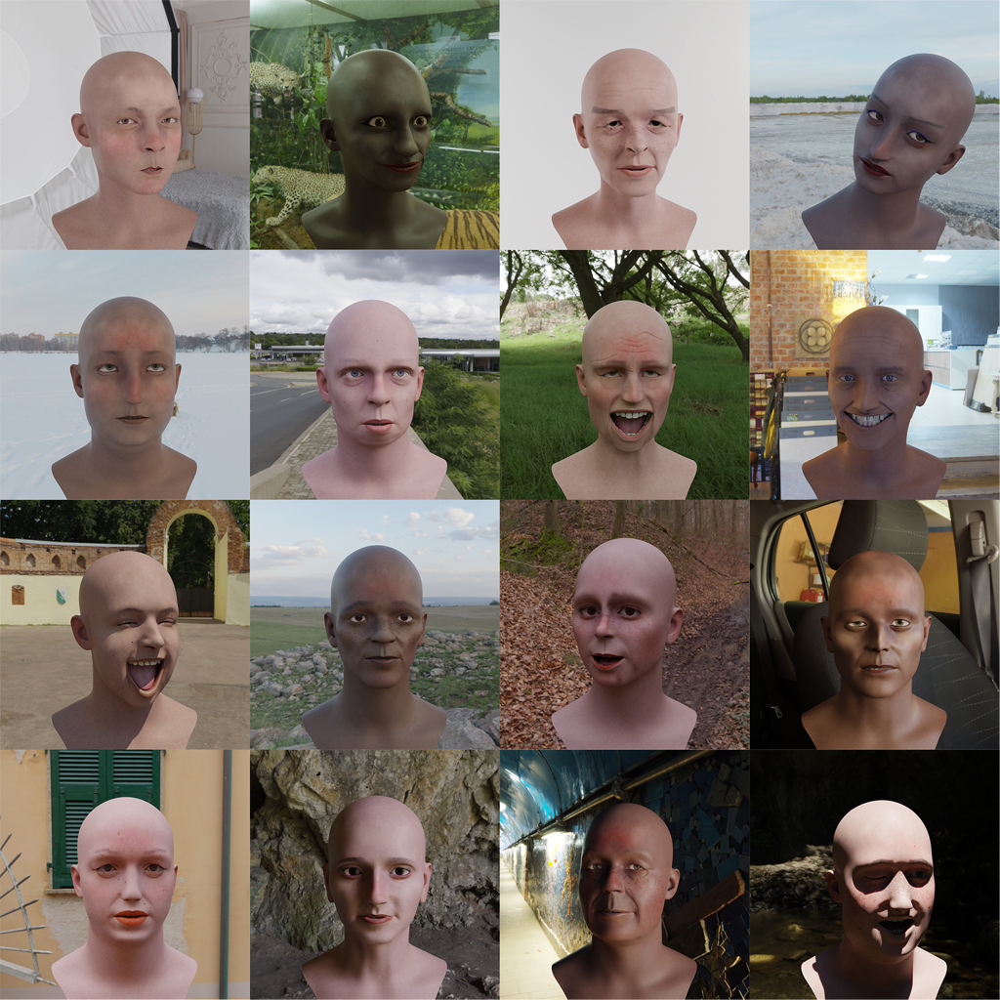
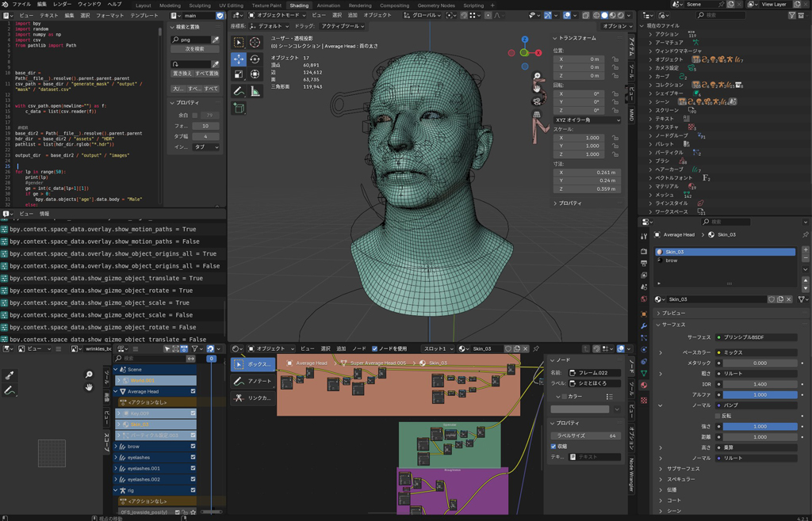

# blender-face-dataset-generator

A Python–Blender pipeline that automatically generates a dataset of rendered 3D face images with diverse variations (skin tone, wrinkles, makeup, hair color, etc.) and compiles corresponding attribute metadata (CSV/XLSX).

📄 日本語版はこちら → [README.ja.md](README.ja.md)

<p align="center">
  
</p>

## 📁 Folder Structure

```

.
├── generate_mask
│ ├── assets/ # Source 3D face models, textures, etc.
│ ├── output/ # Generated mask images & metadata output
│ └── src/
│ ├── main.py # Entry-point: generate mask & attribute CSV/XLSX
│ └── modules/… # Helper modules (e.g. randomizer, exporter)
│
└── generate_face_image
├── assets/ # Blender-compatible assets
├── output/images/ # Rendered face images
├── src/
│ └── main.py # Entry-point: runs Blender render
└── generate_face_image.blend # Blend file with camera, lighting & shaders

```

## 🚀 Getting Started

### Prerequisites

- **Blender** (tested with 4.2+)
- **Python 3.8+**
- Python packages (install via pip):
  ```bash
  pip install -r requirements.txt
  ```

### Installation

1. Clone this repository:

   ```bash
   git clone https://github.com/your-username/blender-face-dataset-generator.git
   cd blender-face-dataset-generator
   ```

2. Install dependencies:

   ```bash
   pip install -r requirements.txt
   ```

3. **Download the Blender scene file**
   You need the `generate_face_image.blend` file to render images. Download it from:
   [Download blender file](https://github.com/NakazawaTakuma/3d-face-dataset-generator/releases/download/v1.0.0/generate_face_image.blend)
   and place it into the `generate_face_image/` folder.

<p align="center">
  
</p>

## 🛠️ Usage

### 1. Generate Masks & Metadata

This step randomizes face attributes (skin tone, wrinkles, etc.) and exports:

- **Mask images** (e.g. segmentation maps)
- **CSV/XLSX metadata** listing all parameters per face

```bash
cd generate_mask
python src/main.py \
  --assets-dir ./assets \
  --output-dir ./output \
  --num-samples 1000 \
  --metadata-format csv
```

**Arguments:**

- `--assets-dir` : Path to your source models/textures
- `--output-dir` : Where to save mask images & metadata
- `--num-samples` : Total number of variations to generate
- `--metadata-format`: `csv` or `xlsx`

### 2. Render Face Images

This step loads your `.blend` file and renders each parameterized face into a high-quality image.

```bash
cd generate_face_image
blender --background generate_face_image.blend \
    --python src/main.py \
    -- --input-metadata ../generate_mask/output/metadata.csv \
       --output-dir ./output-images \
       --resolution 512 512
```

**Arguments:**

- `--input-metadata` : CSV/XLSX from the mask step
- `--output-dir` : Where to save rendered images
- `--resolution` : Width and height of output images

> **Note:** Make sure `generate_face_image.blend` is present in this directory (see Installation step).

## ⚙️ Configuration & Modules

- **`generate_mask/src/modules/`**
  Contains utilities for random attribute sampling, mask generation, and metadata export.
- **`generate_face_image/src/main.py`**
  Reads metadata, applies parameters in Blender (via Python API), and triggers renders.

You can tweak sampling distributions, shader parameters, and camera settings directly in these modules or in your `.blend` file.

## 📝 Output

- **Mask images** & **metadata.csv/xlsx** in `generate_mask/output/`
- **Rendered face images** in `generate_face_image/output/images/`

## 🙏 Contributing

Feel free to open issues or submit pull requests for bug fixes, new features, or performance improvements!
